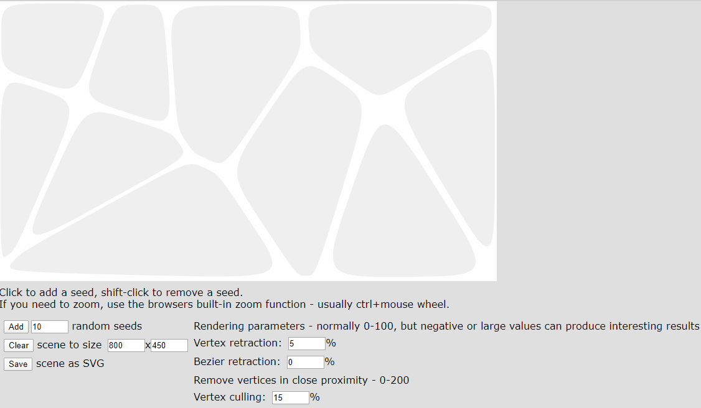

# Overview
This repo is a fork from https://github.com/stg/SVoronoiG
For all comments and changes, please consider forking the original repo

Scope of this fork is enhancing the readme and creating a git hub page for a live demo

# Live Demo
https://websvg.github.io/svg_voronoi_gen/

# Gif Demo

---
# Original Readme
# SVoronoiG

Web-based Voronoi SVG generator
Tested with Firefox ONLY!

License: X11/MIT

Voronoi algorithm by Raymond Hill
File saving & blob building libraries by Eli Grey
Inspired by the Voronoi Tool for Illustrator from Scriptographer.org

Designed to generate SVG files for import into CorelDraw 12, which is the primary software used for our lasercutter
